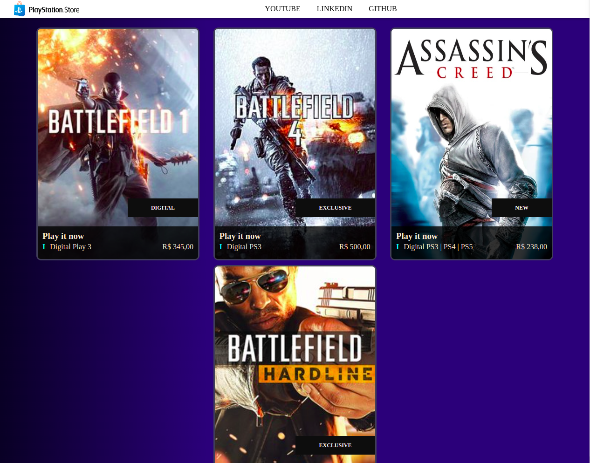

# PlaystationStore

---

## Indice

- [PlaystationStore](#playstationstore)
  - [Indice](#indice)
  - [Sobre](#sobre)
  - [Funcionalidade da Aplicação](#funcionalidade-da-aplicação)
  - [Tecnologias utilizadas](#tecnologias-utilizadas)
  - [Imagem](#imagem)
  - [Como baixar o projeto](#como-baixar-o-projeto)
  - [Autor](#autor)
  
---

## Sobre 

O Projeto **PlaystationStore** foi desenvolvido para criar um clone simples da loja PlayStation.

---

## Funcionalidade da Aplicação

A aplicação exemplo consiste em um clone simples da loja PlayStation. A funcionalidade é:
- Listar Jogos;
- Projeto foi desenvolvido com o máximo de components para dividir as responsabilidade de cada contexto.

---
## Tecnologias utilizadas 

O projeto foi desenvolvido utilizando as seguintes tecnologias
- Angular 12;
- HTML
- CSS

---

## Imagem

<h1>
  
</h1>

---

## Como baixar o projeto

```bash
# Clonar o repositório em sua máquina 
$ git clone https://github.com/francelinom/playstation-store.git

# Entrar na pasta do projeto 
$ cd playstation-store

# Instalar todas as dependências 
$ npm i

# Iniciar o projeto 
npm run dev
# or
yarn dev

Abrir o projeto na porta: http://localhost:3000
```

---
## Autor

Desenvolvido por **Francelino Marcílio da Silva** 
<h1>
  
</h1>

